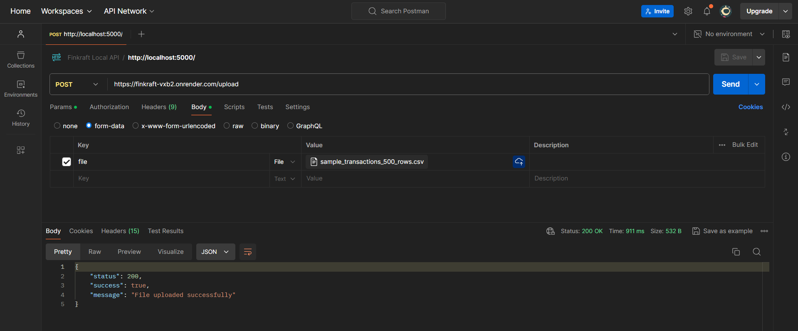

# Documentation: API Endpoint to Parse Uploaded CSV File and Save to Database

NOTE: Please switch to backend directory. I have written only the backend code as per the assignment.
`cd .\backend\`

## Project Setup

The project dependencies are listed in the package.json file. Key dependencies include express for server setup, mongoose for MongoDB interaction, multer for handling file uploads, and csvtojson for parsing CSV files.

## Server Setup

The server is set up in index.js. Express.js is used to create the server, and middleware is added to handle JSON requests, CORS, and URL-encoded bodies. The server connects to MongoDB using Mongoose and the connection string from the environment variables.

## Data Model

The data model for transactions is defined in Transaction.js using Mongoose. The schema includes fields for TransactionID, CustomerName, TransactionDate, Amount, Status, and InvoiceURL.

## File Upload and Parsing

The file upload and parsing logic is in transcationController.js. The uploadFile function uses multer to handle the file upload and csvtojson to parse the CSV file. The parsed data is then saved to the MongoDB database using the Transaction model.

## Routing

The route for file upload is defined in transactionRoute.js. The route is /upload and it uses the uploadFile function from transcationController.js as the handler for POST requests.

## Running the Server locally

The server is started by running node index.js in the terminal. The server listens on port 5000 and routes are accessible at http://localhost:5000.

## Deployed API

The API is deployed on render (https://finkraft-vxb2.onrender.com/)

## Postman upload file

In postman for accessing the upload file endpoint make a POST request on following route
https://finkraft-vxb2.onrender.com/upload

